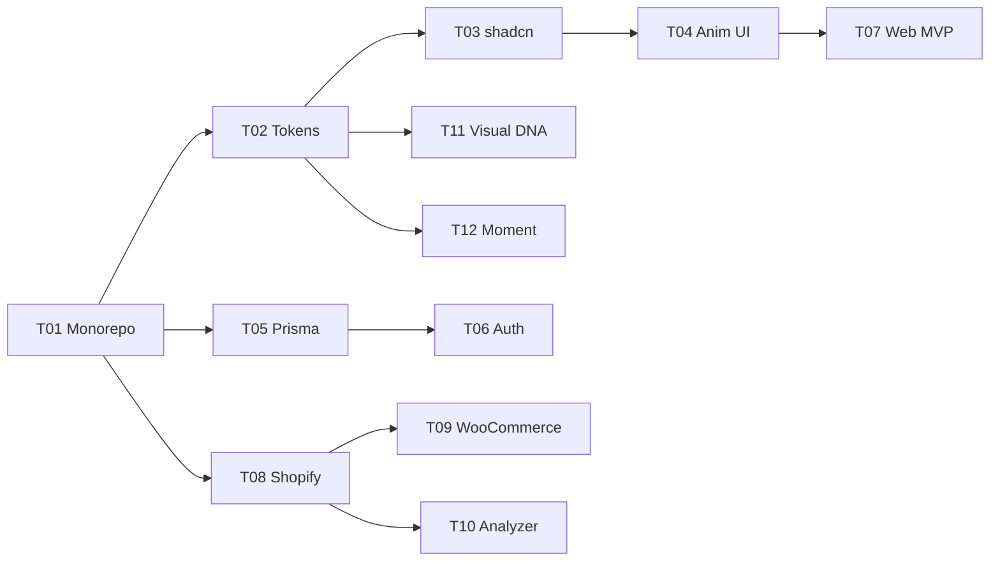

# Forgely 30 Task 进度看板

> 唯一权威：[`docs/MASTER.md`](docs/MASTER.md) 第 33 章（20 周 MVP 计划） + 第 34 章（Task 清单）
> 协作话术：[`docs/AI-DEV-GUIDE.md`](docs/AI-DEV-GUIDE.md)
> GitHub 仓库：<https://github.com/kane-c01/forgely>

---

## 总览（30 Tasks · 20 周 MVP）

| ID  | 标题                             | 周次   | 依赖     | 分支                       | 状态        | PR  | 完成日期   | 负责窗口 |
| --- | -------------------------------- | ------ | -------- | -------------------------- | ----------- | --- | ---------- | -------- |
| T01 | Monorepo 脚手架                  | W1     | —        | `feat/T01-monorepo`        | IN_PROGRESS | —   | —          | W1       |
| T02 | Design Tokens 包                 | W1     | T01      | `feat/T02-design-tokens`   | IN_PROGRESS | —   | —          | W1       |
| T03 | shadcn/ui 基础组件               | W1-2   | T02      | `feat/T03-shadcn-ui`       | PARTIAL     | —   | —          | W2       |
| T04 | Aceternity + Magic UI 组件       | W2     | T03      | `feat/T04-animated-ui`     | TODO        | —   | —          | W2       |
| T05 | 数据库 Schema + Prisma           | W2     | T01      | `feat/T05-prisma-schema`   | REVIEW      | —   | 2026-04-19 | W3       |
| T06 | 认证系统                         | W2     | T05      | `feat/T06-auth`            | TODO        | —   | —          | W3       |
| T07 | 官网 MVP（Hero + Pricing + CTA） | W3     | T04      | `feat/T07-web-mvp`         | TODO        | —   | —          | W5       |
| T08 | Scraper Shopify Adapter          | W4     | T01      | `feat/T08-scraper-shopify` | TODO        | —   | —          | W4       |
| T09 | Scraper WooCommerce Adapter      | W4     | T08      | `feat/T09-scraper-woo`     | TODO        | —   | —          | W4       |
| T10 | Analyzer Agent                   | W4     | T08      | `feat/T10-analyzer`        | TODO        | —   | —          | W1       |
| T11 | 10 个视觉 DNA 预设               | W4     | T02      | `feat/T11-visual-dna`      | TODO        | —   | —          | W2       |
| T12 | 10 个 Moment Prompt 库           | W4     | T02      | `feat/T12-moments`         | TODO        | —   | —          | W2       |
| T13 | Director Agent                   | W5     | T10, T12 | `feat/T13-director`        | TODO        | —   | —          | W1       |
| T14 | Planner Agent + SiteDSL          | W5     | T10, T11 | `feat/T14-planner-dsl`     | TODO        | —   | —          | W1       |
| T15 | Copywriter Agent                 | W5     | T14      | `feat/T15-copywriter`      | TODO        | —   | —          | W1       |
| T16 | Artist Agent（Flux + Kling）     | W5-6   | T13      | `feat/T16-artist`          | TODO        | —   | —          | W1       |
| T17 | Compiler + Deployer              | W6     | T14      | `feat/T17-compile-deploy`  | TODO        | —   | —          | W1       |
| T18 | 用户后台 Dashboard + Products    | W6-7   | T05, T06 | `feat/T18-app-dashboard`   | TODO        | —   | —          | W6       |
| T19 | 订单 / 客户管理                  | W7     | T18      | `feat/T19-orders`          | TODO        | —   | —          | W6       |
| T20 | Media Library + BrandKit         | W8     | T18      | `feat/T20-brand-kit`       | TODO        | —   | —          | W6       |
| T21 | Theme Editor（可视化）           | W9     | T14, T18 | `feat/T21-editor-visual`   | TODO        | —   | —          | W6       |
| T22 | Theme Editor（AI 对话）          | W9     | T21      | `feat/T22-editor-ai`       | TODO        | —   | —          | W6       |
| T23 | AI Copilot（Tool Use）           | W9     | T18      | `feat/T23-copilot`         | TODO        | —   | —          | W6       |
| T24 | 积分系统 + Stripe                | W9     | T06      | `feat/T24-credits-stripe`  | TODO        | —   | —          | W3       |
| T25 | Super Admin - Overview           | W10    | T18      | `feat/T25-super-overview`  | TODO        | —   | —          | W7       |
| T26 | Super Admin - Users / Finance    | W10    | T25      | `feat/T26-super-finance`   | TODO        | —   | —          | W7       |
| T27 | 官网 - Terminal 升级             | W11-13 | T07      | `feat/T27-web-terminal`    | TODO        | —   | —          | W5       |
| T28 | 多源 Scraper 扩展                | W14    | T08      | `feat/T28-scraper-multi`   | TODO        | —   | —          | W4       |
| T29 | Compliance Agent                 | W15    | T10      | `feat/T29-compliance`      | TODO        | —   | —          | W8       |
| T30 | SEO/GEO 完整实现                 | W16    | T14      | `feat/T30-seo-geo`         | TODO        | —   | —          | W8       |

**状态图例**：`TODO` 未开始 · `IN_PROGRESS` 进行中 · `PARTIAL` 部分完成 · `REVIEW` 待 review · `DONE` 已合并

---

## 多窗口分工模型

> **技术约束**：每个 my-mcp-N 是绑定单个 Cursor 窗口的会话通道，窗口间 AI 不能互相直接派活。**实操方式**：W1 主线拆 Task → 输出"派给 my-mcp-N 的 Prompt 包"（见下方"待派发 Prompt"区）→ 你手动复制到对应窗口的 Cursor。

### 窗口角色分配

| 窗口            | MCP 通道  | 长期职责                                  | Task 簇            |
| --------------- | --------- | ----------------------------------------- | ------------------ |
| **W1 主线**     | my-mcp-1  | 架构 / AI Agents / 生成 Pipeline / 协调   | T01, T10, T13-T17  |
| **W2 UI**       | my-mcp-2  | 共享组件 / Storybook / 视觉 DNA / Moment  | T03, T04, T11, T12 |
| **W3 后端**     | my-mcp-3  | DB / Auth / 积分 / Stripe                 | T05, T06, T24      |
| **W4 Scraper**  | my-mcp-4  | 爬虫 Adapter（Shopify/WC/Amazon/AI 兜底） | T08, T09, T28      |
| **W5 官网**     | my-mcp-5  | apps/web（MVP + Terminal 升级）           | T07, T27           |
| **W6 用户后台** | my-mcp-6  | apps/app（Dashboard / Editor / Copilot）  | T18-T23            |
| **W7 超级后台** | my-mcp-7  | /super 模块 + 审计                        | T25, T26           |
| **W8 合规/SEO** | my-mcp-8  | Compliance Agent + SEO/GEO                | T29, T30           |
| **W9 备用**     | my-mcp-9  | 替补 / 紧急 hotfix                        | 临时               |
| **W10 监控**    | my-mcp-10 | PR review / 跨窗口监控                    | 临时               |

### git 协作（避免冲突的关键）

每个窗口在本地用独立 worktree 工作，零冲突：

```bash
# 在主仓库根目录运行（W1 一次性创建所有 worktree）
git worktree add ../forgely-W2 -b feat/T03-shadcn-ui
git worktree add ../forgely-W3 -b feat/T05-prisma-schema
git worktree add ../forgely-W4 -b feat/T08-scraper-shopify
git worktree add ../forgely-W5 -b feat/T07-web-mvp
git worktree add ../forgely-W6 -b feat/T18-app-dashboard
git worktree add ../forgely-W7 -b feat/T25-super-overview
git worktree add ../forgely-W8 -b feat/T29-compliance

# 每个窗口的 Cursor 打开对应物理目录：
#   W2 → ~/Desktop/forgely-W2
#   W3 → ~/Desktop/forgely-W3
#   ...
# 完成后该窗口推到 GitHub → 创建 PR → W10 review → 合并到 main
```

### T01 完成后可立即并行的 4 个 Task

依赖图：



**T01 完成后立即可派的窗口**：W2 (T03) · W3 (T05+) · W4 (T08) · W5 (T07-准备占位)

---

## 待派发 Prompt 包（W1 完成 T01 后填充）

> 每个 Task 一个完整指令模板。你只需复制到对应窗口的 Cursor 输入框即可。

### 派给 my-mcp-2（W2 UI）— T03

```text
（待 T01 完成后填充，预计内容：分支 feat/T03-shadcn-ui，按 docs/MASTER.md 32.2 P0 清单完成 20+ shadcn 组件 + Storybook ...）
```

### 派给 my-mcp-3（W3 后端）— T05 完善

```text
（待 T01 完成后填充）
```

### 派给 my-mcp-4（W4 Scraper）— T08

```text
（待 T01 完成后填充）
```

### 派给 my-mcp-5（W5 官网）— T07

```text
（待 T01 完成后填充）
```

---

## 历史会话纪要

### 会话 1（2026-04-19）

- 阅读完整 4 份开发文档（MASTER.md v1.2 FINAL + AI-DEV-GUIDE + v1.0/v1.1 历史）
- 创建 plan：[Forgely 启动与 30 Task 推进](.cursor/plans/forgely_启动与_30_task_推进_dfcb9c42.plan.md)
- 完成项目治理：docs/ 归档 / README / .gitignore / git init / 接入 kane-c01/forgely
- 完成 T01 Monorepo 脚手架（pnpm + Turborepo + 3 apps + 14 packages + 4 services + CI）
- 完成 T02 Design Tokens 包
- 部分完成 T03（5 个核心 shadcn 组件）
- 完成 T05 Prisma schema 全部核心模型
- apps/web 最小可启动首页验证全链路

下次会话从 T03 完整版 + T04 接力。
